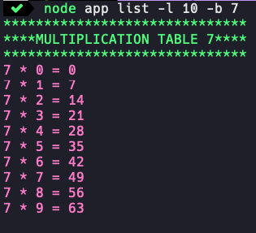

# Complicated Multiplication Table

### Installs

* Without `package.json`.

run `npm install yargs`

run `npm install colors --save`

* With `package.json` and packages added.

run `npm install`

### Structure

run `tree -I "node_modules"`
```shell
.
├── README.md
├── app.js
├── config
│   ├── index.js
│   └── yargs.js
├── multiplication-table
│   ├── index.js
│   └── multiplication.js
├── package-lock.json
├── package.json
├── screenshots
│   └── show-table.png
└── table
    └── default-table.txt

4 directories, 10 files
```

### Help

run `node app --help`
```shell
app [command]

Commands:
  app list    Imprime en consola la table de Multiplicar.
  app create  Crea un archivo con la tabla de Multiplicar por
              defecto o especifico a la base.

Options:
  --version  Show version number                           [boolean]
  --help     Show help                                     [boolean]
```
run `node app create --help`
```shell
app create

Crea un archivo con la tabla de Multiplicar por defecto o especifico
a la base.

Options:
  --version    Show version number                         [boolean]
  --help       Show help                                   [boolean]
  --base, -b
  --limit, -l                                          [default: 10]
```

### list command

run `node app list -l 10 -b 7`
```shell
******************************
****MULTIPLICATION TABLE 7****
******************************
7 * 0 = 0
7 * 1 = 7
7 * 2 = 14
7 * 3 = 21
7 * 4 = 28
7 * 5 = 35
7 * 6 = 42
7 * 7 = 49
7 * 8 = 56
7 * 9 = 63
```

### Screenshots

<p align="center">
  <kbd>
    
  </kbd>
</p>

